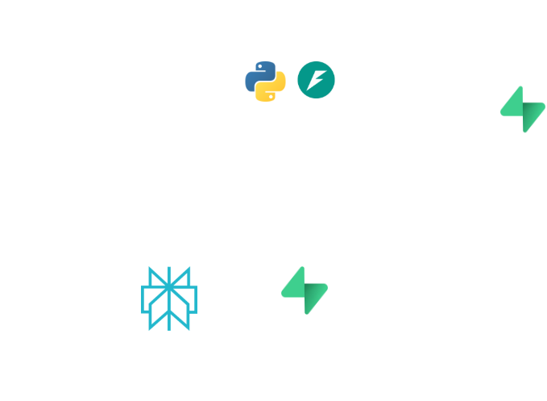

# Casino AI Research System

An automated AI-powered system for discovering licensed casinos and comparing promotional offers across multiple US states using Perplexity AI, deployed with serverless architecture.

## 🏗️ System Architecture



### Architecture Overview

The system consists of four main components working together:

1. **Backend (Python + FastAPI)** - Core research engine and API
2. **AI Research (Perplexity AI)** - Discovers casinos and analyzes promotions
3. **Database (Supabase)** - Stores research results and manages scheduled tasks
4. **Frontend (Next.js)** - Dashboard for viewing and managing research data
5. **Deployment (Vercel)** - Serverless hosting for both backend and frontend

## 🔑 Key Features

- **Automated Casino Discovery**: Identifies licensed/operational casinos in NJ, MI, PA, and WV
- **Promotional Research**: Analyzes current casino welcome bonuses and offers
- **Intelligent Comparison**: Compares discovered offers against existing database
- **Scheduled Execution**: Automated daily runs using Supabase Cron Jobs
- **Manual Triggers**: On-demand research runs via dashboard
- **Historical Reports**: View and compare past research runs

## 🔧 Technical Stack

### Backend
- **FastAPI** - Modern Python web framework
- **Perplexity AI (Sonar model)** - AI-powered research and data extraction
- **Supabase Client** - Database interactions and storage
- **Vercel** - Serverless deployment platform

### Frontend
- **Next.js 14** - React framework with App Router
- **TypeScript** - Type-safe development
- **Tailwind CSS** - Utility-first styling
- **Supabase JS Client** - Direct database queries

### Database
- **Supabase (PostgreSQL)** - Main data storage
- **Cron Jobs** - Automated task scheduling
- **Edge Functions** - Scheduled research execution

## 📊 Data Flow

```
1. Trigger (Manual/Scheduled)
   ↓
2. FastAPI Backend receives request
   ↓
3. For each state (NJ, MI, PA, WV):
   - Query Perplexity AI for licensed casinos
   - Parse JSON response
   ↓
4. For each discovered casino:
   - Query Perplexity AI for current promotions
   - Extract bonus details (amount, match %, description)
   ↓
5. Compare with existing offers:
   - Calculate bonus values
   - Classify: Better, Worse, Same, Alternative, New Casino
   ↓
6. Save results to Supabase
   ↓
7. Frontend fetches and displays data
```

## 🚀 Setup & Installation

### Prerequisites
- Python 3.12+
- Node.js 18+
- Supabase account
- Perplexity AI API key
- Vercel account (for deployment)

### Backend Setup

```bash
cd backend
python -m venv venv
source venv/bin/activate  # On Windows: venv\Scripts\activate
pip install -r requirements.txt
```

Create `.env` file:
```env
PERPLEXITY_API_KEY=your_api_key_here
SUPABASE_URL=your_supabase_url
SUPABASE_KEY=your_supabase_anon_key
EXISTING_OFFERS_API=https://xhks-nxia-vlqr.n7c.xano.io/api:1ZwRS-f0/activeSUB
```

Run locally:
```bash
uvicorn app:app --reload
```

### Frontend Setup

```bash
cd frontend/casino-ai-research
npm install
```

Create `.env.local`:
```env
NEXT_PUBLIC_API_URL=https://your-vercel-backend.vercel.app
NEXT_PUBLIC_SUPABASE_URL=your_supabase_url
NEXT_PUBLIC_SUPABASE_ANON_KEY=your_supabase_anon_key
```

Run locally:
```bash
npm run dev
```

## 🔌 API Endpoints

### Backend (FastAPI)

| Endpoint | Method | Description |
|----------|--------|-------------|
| `/` | GET | Health check |
| `/api/results?mode=manual` | GET | Trigger manual research run |
| `/api/results?mode=last` | GET | Fetch last saved report |
| `/api/results/scheduled` | POST | Scheduled research endpoint |

### External APIs

- **Perplexity AI**: `https://api.perplexity.ai/chat/completions`
- **Existing Offers**: `https://xhks-nxia-vlqr.n7c.xano.io/api:1ZwRS-f0/activeSUB`

## 📋 Response Structure

### Research Result
```json
{
  "timestamp": "2025-11-11T12:00:00Z",
  "missing_casinos": {
    "New Jersey": ["Casino A", "Casino B"],
    "Michigan": ["Casino C"]
  },
  "offer_comparisons": [
    {
      "casino": "BetMGM",
      "state": "New Jersey",
      "current_offer": "...",
      "new_offer": "...",
      "current_bonus": 1000,
      "new_bonus": 1025,
      "status": "Better",
      "new_details": {
        "casino": "BetMGM",
        "state": "New Jersey",
        "promotion": "Welcome Offer",
        "bonus_amount": 1025,
        "match_percent": 100,
        "description": "..."
      }
    }
  ]
}
```

## ⚖️ Tradeoffs & Limitations

### Model Selection
- **Chosen**: Perplexity Sonar (lightweight, fast, cost-effective)
- **Tradeoff**: Less sophisticated than GPT-4, but sufficient for structured data extraction
- **Temperature**: Low (0.2-0.3) to maintain consistency
- **Impact**: Occasionally returns markdown-wrapped JSON requiring cleanup

### API Rate Limits
- **Perplexity API**: Rate limits apply per account tier
- **Current Approach**: Sequential state processing (not parallelized)
- **Impact**: ~2-4 minutes per full research run (4 states × ~5 casinos each)

### Data Accuracy
- **Source Dependency**: Relies on Perplexity's web search capabilities
- **Regulatory Changes**: Gaming commission data may not be instantly reflected
- **Validation**: No automated verification against official sources
- **Recommendation**: Manual review of "Better" and "New Casino" flags

### Serverless Constraints
- **Vercel**: 10-second timeout on Hobby plan, 60s on Pro
- **Workaround**: Results saved to Supabase; frontend fetches after completion
- **Limitation**: No true real-time progress tracking (in-memory state lost)

### Prompt Consistency
- **Challenge**: AI responses sometimes include markdown formatting
- **Mitigation**: Backend strips ```json code blocks before parsing
- **Remaining Risk**: Occasional parsing failures handled with try/catch

## 🔮 Future Improvements

### Performance
- [ ] Parallelize state/casino processing using `asyncio`
- [ ] Implement request batching for Perplexity API
- [ ] Add Redis for distributed progress tracking
- [ ] Cache frequently accessed casino data

### AI Enhancement
- [ ] Experiment with GPT-4 for higher accuracy
- [ ] Add confidence scores to AI predictions
- [ ] Implement multi-source verification
- [ ] Fine-tune prompts with few-shot examples

### Features
- [ ] Email notifications for "Better" offers
- [ ] Offer trend analysis over time
- [ ] State-specific filtering in dashboard
- [ ] Export reports to PDF/Excel
- [ ] Webhook integrations for third-party systems

### Data Quality
- [ ] Automated validation against official gaming commission APIs
- [ ] Human-in-the-loop review workflow
- [ ] Historical offer tracking and versioning
- [ ] Duplicate casino detection across states

### Monitoring
- [ ] Add logging with Sentry/LogRocket
- [ ] API usage and cost tracking
- [ ] Performance metrics dashboard
- [ ] Alerting for failed research runs

## 🛡️ Security Considerations

- API keys stored in environment variables
- Supabase Row Level Security (RLS) policies should be configured
- Frontend uses public (anon) key for read-only operations
- Backend authenticates with service role key for writes
- CORS properly configured for Vercel domains

## 📝 Key Design Decisions

1. **Serverless Architecture**: Chose Vercel for zero-ops scaling and cost efficiency
2. **Supabase over Custom DB**: Managed PostgreSQL with built-in Cron Jobs
3. **Perplexity over GPT**: Lower cost, faster responses for structured extraction
4. **JSON Prompting**: Explicit JSON structure requests for consistent parsing
5. **State-by-State Processing**: Sequential to avoid overwhelming API limits
6. **Frontend Direct DB Access**: Supabase client for historical reports (read-only)

## 📄 License

MIT License - Feel free to use and modify for your needs.

## 🤝 Contributing

This is a proof-of-concept system. For production use, consider implementing the improvements listed above, particularly around error handling, monitoring, and data validation.

---

**Built with**: Python • FastAPI • Perplexity AI • Next.js • Supabase • Vercel

